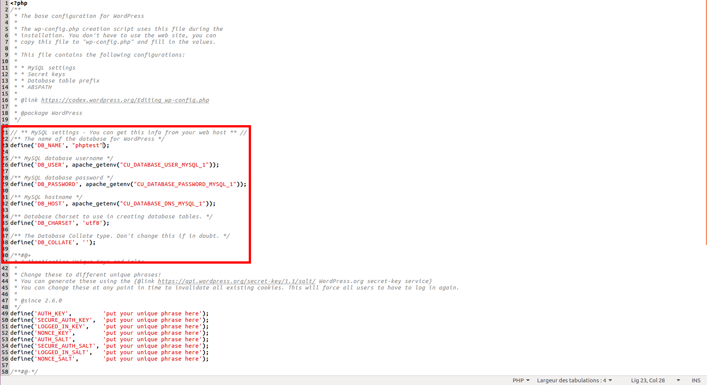

# Deploy an PHP application in CloudUnit

In this part, we will use WordPress in support like example.

## Create CloudUnit application

First, after launch CloudUnit, you need to create an Apache application.

## Configure the application

WordPress use MySQL for its databases. So, we need to add MySQL module. Version of MySQL doesn't matter in this example, choose the version you want to use.

In *Settings* tab, you can add a domain name if you want. For that, write your domain name and click on *Add an alias*.

Now, the application is configured, so restart it for update changes in *Overview* tab.

## Deploy WordPress

You can clone the Git repository [here](https://github.com/WordPress/WordPress.git).
After download, go to WorkPress directory and copy the file *wp-config-sample.php* then rename it to *wp-config*.

Edit this file and add your MySQL configuration (host, database name, username, password) which you can find in *Overview* tab.

Compress this directory in zip or tar.gz at your convenience and go to *Explorer* tab in */var/www* directory.
Use *Upload file* to add your compressed file to the application and uncompress it.

Then, edit the *index.html* file and replace the page with a redirect to your own index page.

Finally, open a new tab in your browser and go to your homepage (Use your domain name if you used this feature or use the name defined above).

That's all ! You have deploy an WordPress in CloudUnit.

